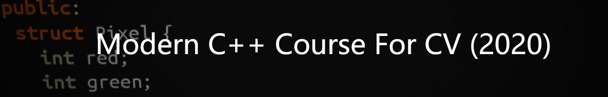

# Modern C++ Course For CV Note

My note for [Modern C++ Course For CV (2020)](https://www.ipb.uni-bonn.de/teaching/cpp-2020/tutorials/).

You can see [must-have-tools](https://github.com/nachovizzo/must-have-tools/wiki) for the tools you my need.

## [build_tools](./build_tools)

* The compilation process
* Libraries
* Build Systems

## [core_cpp](./core_cpp)

* C++, the legals
* Control structures
* Built-in types
* Variables
* Streams

